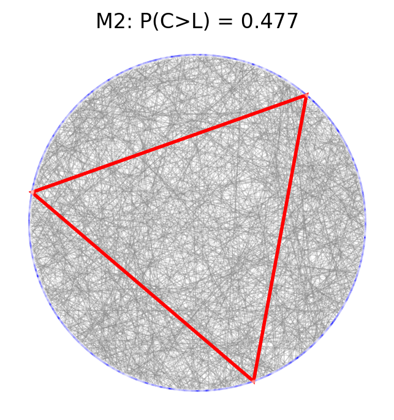
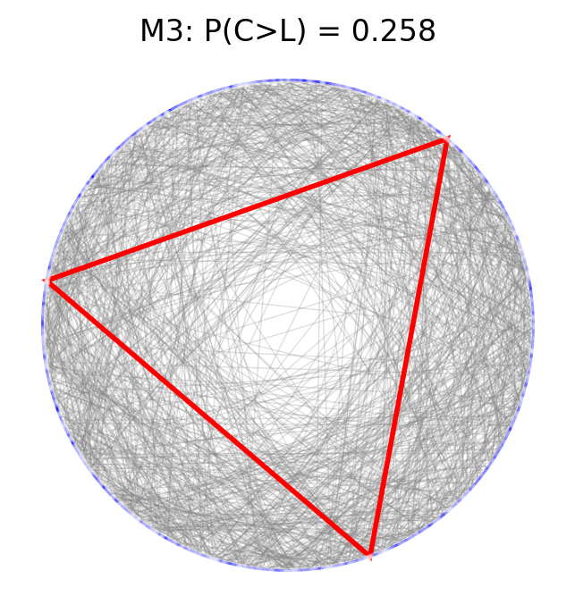

# Python implementation simulating Bertrand's famous paradox

## Method 1

 

## Method 2

 

## Method 3

### The 'paradox' is seen to be the ambiguity in generating a 'random' chord.
> The assumption that this isn't or should not be ambiguous is what leads one to confusion.
> The question of 'which method' one should use is seen to be contextual.
> However, M2 is also seen to minimize bias by generating a chord from random (r,theta).
> This is the definition of a circle, so it should not be surprising.
> Indeed, if the probability was of a line through a square instead, (x,y) would minimize bias.
